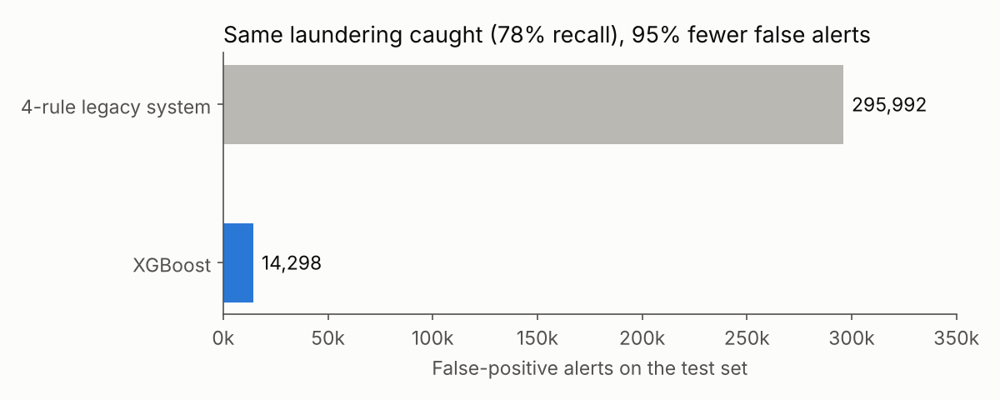
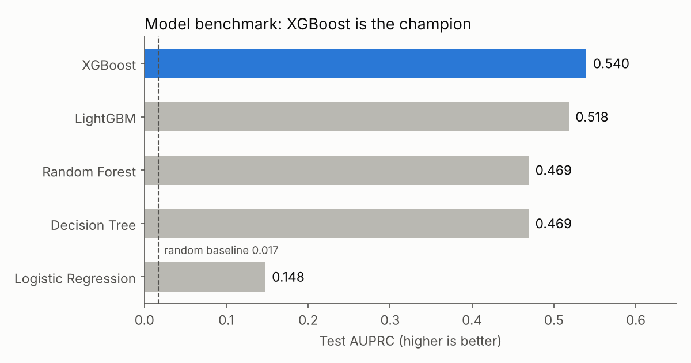
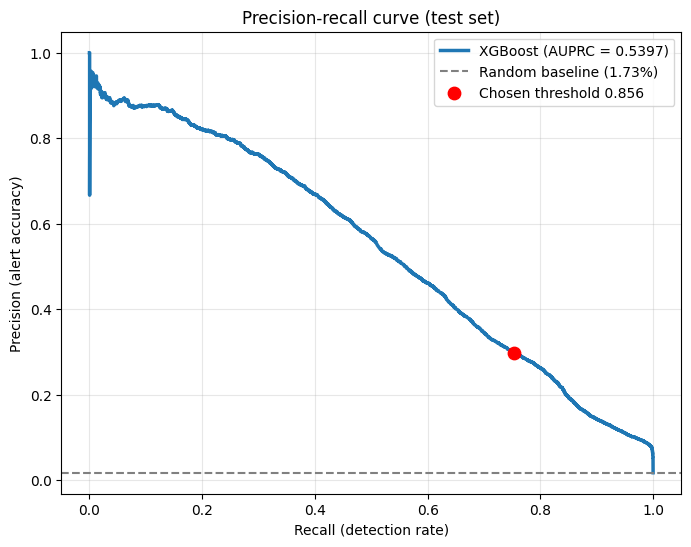
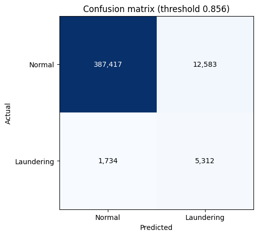
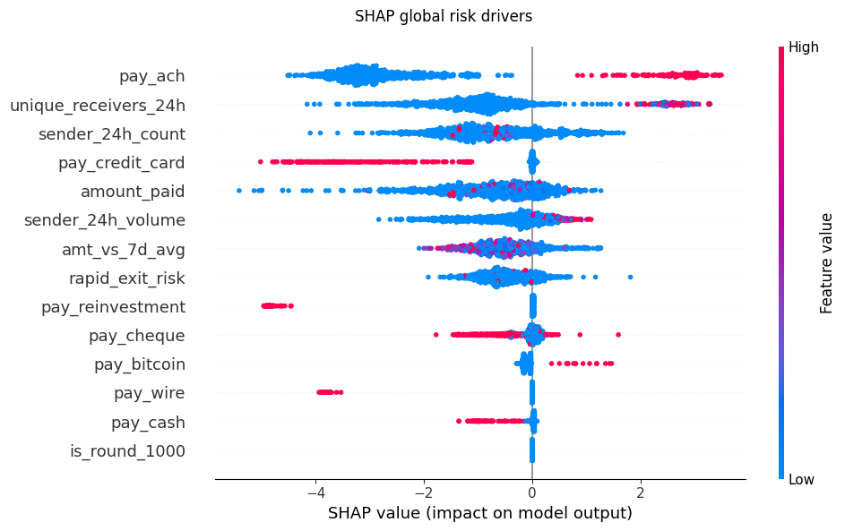
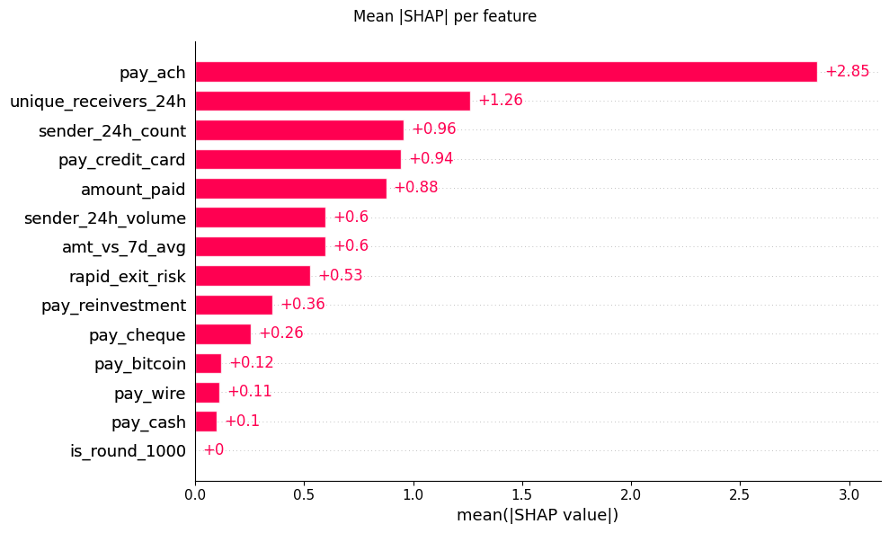
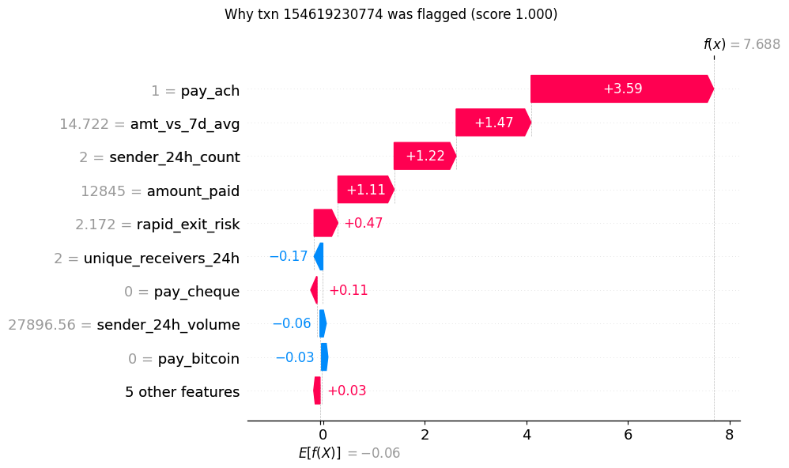

# Machine Learning for Anti-Money-Laundering (AML) Detection — on Azure Databricks

**MSc Business Analytics project, Aston University (2025–2026), rebuilt as a Databricks lakehouse pipeline**
Author: Mahendra Varma Gottumukkala

An end-to-end anti-money-laundering detection pipeline on **31.9 million transactions**. It uses Delta Lake
bronze/silver/gold tables, PySpark behavioural feature engineering, a five-model benchmark tracked in MLflow,
SHAP reason codes for every alert, and a comparison against a traditional rule-based monitoring system.

> **Scope.** This is an academic study on the *synthetic* IBM AMLworld dataset. It is not a deployed counter-fraud
> system. The results show that the method works, not how it would perform on a real bank's data.

---

## Headline results

| | |
|---|---|
| **Champion model** | XGBoost |
| **AUPRC (test)** | **0.540**, about 31× the random baseline of 0.017 |
| **ROC-AUC (test)** | 0.973 |
| **Recall at chosen threshold** | 75.4% of laundering caught while flagging 4.4% of transactions |
| **vs 4-rule legacy system, at equal recall** | **95.2% fewer false-positive alerts** (14,298 vs 295,992) |



---

## Problem

Money laundering is rare, adversarial and expensive to investigate:

- **Extreme class imbalance.** About 0.11% of transactions are laundering, so accuracy is meaningless.
- **Asymmetric costs.** A missed case is costly, but every false alert uses up investigator time.

The goal is therefore **high recall with a manageable, risk-ranked alert queue**, where every alert comes with
reasons an investigator can act on.

## Architecture

```
Kaggle (IBM AMLworld, HI-Medium)
        │  00_download — Kaggle API → Unity Catalog volume
        ▼
BRONZE  aml.bronze.transactions         31.9M rows, real "Is Laundering" label + laundering typology
        │  02_features — PySpark window functions over ALL rows (24h / 7d per sender)
        ▼
SILVER  aml.silver.features             14 behavioural features (+ is_interbank)
        │  03_train — sample (all positives + 2M normal), 60/20/20 split, 5 models, MLflow
        ▼
GOLD    aml.gold.training_set · benchmark_results · test_predictions · champion
        │  04_explain — PR curve, confusion matrix, SHAP (global + per-alert)
        │  05_rule_baseline — 4-rule legacy system on the same test set
        ▼
        aml.gold.alert_reason_codes · aml.gold.rbs_comparison · MLflow figures
```

**Stack:** Azure Databricks (serverless), Unity Catalog, Delta Lake, PySpark, MLflow, scikit-learn, XGBoost,
LightGBM, SHAP. The notebooks run as a multi-task Databricks Job.

## Data

- **Source:** [IBM Transactions for Anti-Money Laundering](https://www.kaggle.com/datasets/ealtman2019/ibm-transactions-for-anti-money-laundering-aml), HI-Medium split.
- **31,898,238 transactions, of which 35,230 are laundering** (0.11%), from the dataset's own `Is Laundering` label.
- 22,743 laundering transactions belong to one of 8 named typologies. The rest are unpatterned.

| Typology | Laundering txns | | Typology | Laundering txns |
|---|---|---|---|---|
| GATHER-SCATTER | 4,289 | | CYCLE | 2,235 |
| SCATTER-GATHER | 3,988 | | BIPARTITE | 2,135 |
| STACK | 3,986 | | FAN-OUT | 2,128 |
| FAN-IN | 2,315 | | RANDOM | 1,667 |
| *(no named pattern)* | *12,487* | | | |

## Features (mapped to FATF typologies)

All rolling features are computed per sender over the **full** 31.9M-row history before any sampling.

| Feature | What it captures |
|---|---|
| `sender_24h_count`, `sender_24h_volume` | Velocity / **placement** |
| `amt_vs_7d_avg` | Deviation from the sender's normal behaviour / **structuring** |
| `unique_receivers_24h` | Fan-out / **layering** (mule behaviour) |
| `rapid_exit_risk` | Pass-through: 24h outflow relative to this payment |
| `is_round_1000` | Round-number amounts |
| `pay_*` (7 one-hots) | Payment channel |

## Results

### Model benchmark

The threshold for each model is the highest one that keeps **recall ≥ 75% on the validation set**. The champion
is the model with the best *validation* AUPRC. The test set is scored only once.



| Model | Val AUPRC | Test AUPRC | ROC-AUC | Recall | Precision* |
|---|---|---|---|---|---|
| **XGBoost** | **0.529** | **0.540** | **0.973** | 75.4% | 29.7% |
| LightGBM | 0.502 | 0.518 | 0.973 | 75.8% | 29.7% |
| Random Forest | 0.460 | 0.469 | 0.916 | 77.0% | 19.9% |
| Decision Tree | 0.454 | 0.469 | 0.954 | 77.4% | 26.5% |
| Logistic Regression | 0.146 | 0.148 | 0.935 | 75.5% | 12.0% |

\*Precision is measured on the sampled test set (1.73% positive). At the dataset's natural rate (0.11%), precision
at the same recall would be roughly 3%. Validation and test AUPRC are close, so there's no sign of overfitting.

<p float="left">
  
  
</p>

At threshold 0.856 the model flags 17,895 of 407,046 test transactions (4.4%). Those alerts contain
**5,312 of the 7,046 laundering cases**. Its highest-scoring alerts are about 85–90% precise, which supports a
risk-based review queue.

### Model vs the rule-based system

The legacy system raises an alert if any of these rules fires: amount > 10,000; more than 3 transactions in 24h;
an exact multiple of 1,000; an inter-bank transfer > 5,000. It is scored on the **same test set** as the model.

| System | Alerts | Laundering caught | False positives | Recall | Alert rate |
|---|---|---|---|---|---|
| 4-rule legacy system | 301,498 | 5,506 | 295,992 | 78.1% | 74.1% |
| **XGBoost, same recall** | **19,804** | 5,506 | **14,298** | 78.1% | 4.9% |

**At equal recall, the model raises 95.2% fewer false positives.** Normal transactions were sampled at random, so
this ratio does not depend on the sampling rate.

| Rule | Alerts | Precision | Recall |
|---|---|---|---|
| Inter-bank > 5,000 | 125,321 | 3.6% | 63.3% |
| Amount > 10,000 | 109,510 | 3.0% | 46.2% |
| > 3 txns in 24h | 252,499 | 1.2% | 41.3% |
| Round 1,000s | 7 | 0% | 0% |

### Explainability (SHAP)

<p float="left">
  
  
</p>

1. **`pay_ach`** is the strongest driver. In this synthetic dataset laundering is generated mostly through ACH, so
   this partly reflects how the data was simulated and would be expected to generalise less well.
2. **`unique_receivers_24h`** (fan-out) is the strongest *behavioural* signal: sending to many accounts in 24h
   raises risk, which is the layering / mule pattern.
3. **Velocity** (`sender_24h_count`, `sender_24h_volume`) and **deviation from normal** (`amt_vs_7d_avg`) follow.
4. **`is_round_1000` contributes nothing.** The round-amount heuristic used in legacy rules has no predictive value here.

**Per-alert reason codes.** Every alert can be explained on its own. For the case below, an ACH payment at 14.7×
the sender's 7-day average, during a burst of activity, with funds passed straight on, scored 1.000. The top-3
reasons for each of the top 1,000 alerts are stored in `aml.gold.alert_reason_codes`.



## Correction to the original dissertation analysis

The first version of this project (Colab, 2026) had a **labelling error**. It extracted every number from the
patterns file with a regular expression, including years, minutes, bank IDs and parts of amounts, and treated them
as row indices. As a result 18,391 mostly incorrect rows were labelled as laundering, instead of the dataset's
35,230 real positives. The earlier headline figures (AUPRC 0.117, a 74% false-positive reduction, and
`rapid_exit_risk` as the top driver) were measured against those labels and **are superseded by the results above**.

The rebuild also fixes three methodology issues:
- Rolling features were computed *after* sampling, which removed about 94% of normal accounts' history. They are now computed on the full data.
- The recall threshold and the champion were chosen on the test set. They are now chosen on validation.
- Two of the four legacy rules never fired because of a missing column and a failed merge. All four now run.

## Repository structure

```
├── README.md
├── databricks/                 # Databricks notebooks (source format; import or use a Git folder)
│   ├── 00_download.py          # Kaggle API → Unity Catalog volume
│   ├── 01_ingest.py            # Bronze: transactions + label + typology
│   ├── 02_features.py          # Silver: PySpark window features over 31.9M rows
│   ├── 03_train.py             # Gold: sample, split, 5 models, MLflow, champion
│   ├── 04_explain.py           # PR / confusion / SHAP figures, reason codes
│   └── 05_rule_baseline.py     # Legacy rules vs model at equal recall
├── figures/                    # Figures from the Databricks run
├── results/                    # Result tables (CSV) from the Databricks run
├── requirements.txt
└── LICENSE
```

## How to run

1. Create an Azure Databricks workspace (Premium, serverless) with Unity Catalog.
2. In Databricks, go to **Workspace → Create → Git folder** and point it at this repo, or import the `.py` files.
3. Run `00_download` with your Kaggle username and API key in the widgets.
4. Run `01` → `05` on Serverless, or create a **Job** with five notebook tasks in sequence and a job parameter `catalog=aml`.
5. Results appear in Unity Catalog (`aml.gold.*`) and under **Experiments → aml-detection** in MLflow.

The PySpark features were checked against the original pandas logic and match exactly, except for
transactions from the same account in the same minute. Spark counts all of those, while pandas counted only the
earlier ones.

## Limitations and next steps

- **Synthetic data.** Absolute performance will not transfer to real transaction data.
- **Random split.** A forward-in-time split (train on earlier days, test on later ones) would be a stricter test.
- **Payment format dominates.** A behaviour-only model, without the `pay_*` features, would show how much signal the behavioural features carry on their own.
- **Graph features.** Account-network features such as cycles and fan-in/fan-out depth would target the typologies directly.
